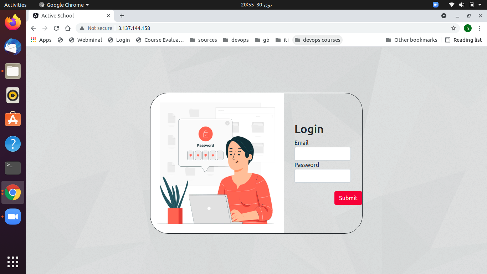
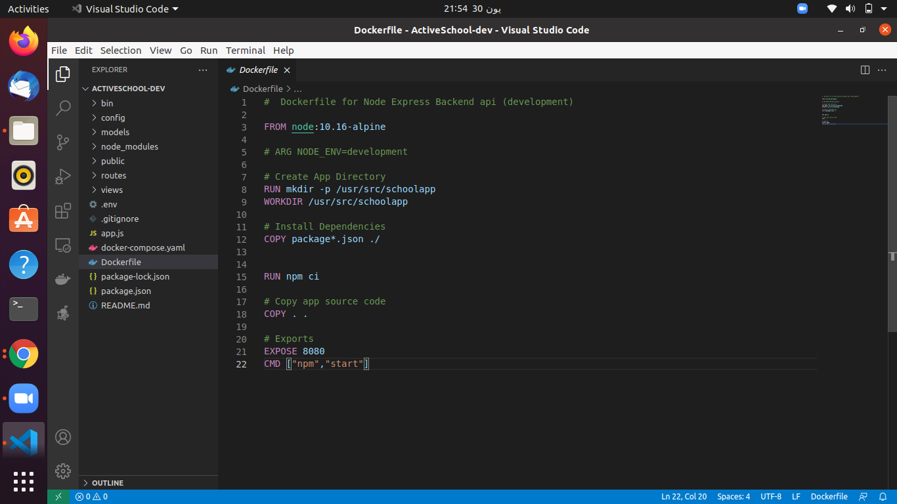
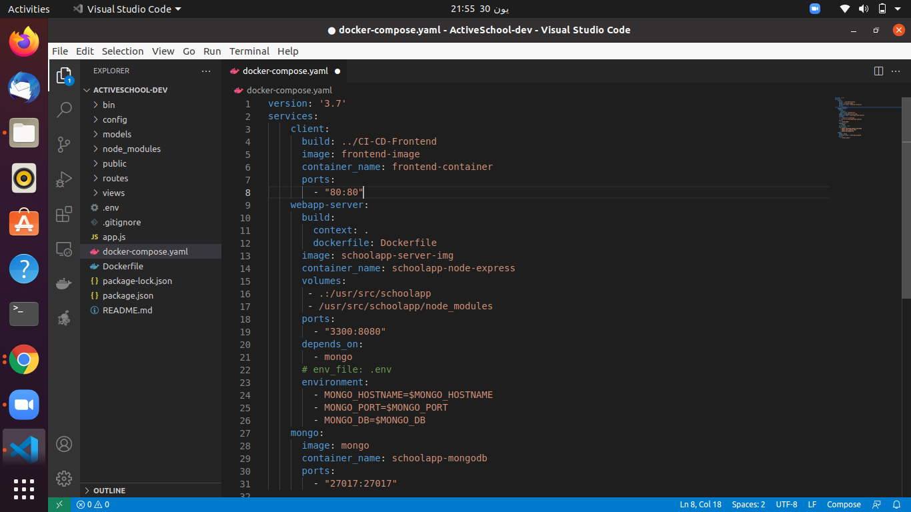

# Welcome to ourActiveSchool application server
## To visit our website follow the link below:
http://3.137.144.158/.  
 
 
 
## Getting up and running
To get the Node server running locally:  
  • Clone this repo  
  • run	cd ActiveSchool  
  •	To install all required dependencies: run npm install  
  • To start the local server: run npm start  
  •	copy the link  http://localhost:3200 in the browser to see the server running.  
Now the server is waiting the clientside to run.  
Download Clientside from this link (https://github.com/Maymaher/ActiveSchool-ClientSide).  
 
## Built With
  •	Nodejs   
  •	Mongodb  
  •	Express  
    
## Dockerize Express and Mongodb
  • Create Dockerfile to the root serverside folder. 
    
   
  • Create docker-compose.yml file to run Express together with mongodb.  
    
   
  • To build the images : run docker-compose build  
  • To run the containers: run docker-compose up  

