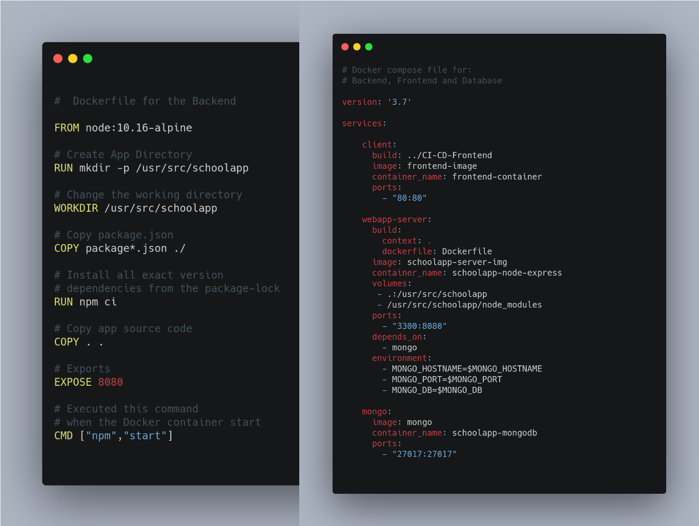

# Welcome to our ActiveSchool application serverside
## To visit our website follow the link below:
http://3.137.144.158/.</br> 
</br>
 
</br>
## Getting up and running
To get the Node server running locally: </br> 
  • Clone this repo
  ```sh
  git clone https://github.com/Maymaher/ActiveSchool.git
  ```
  • Change the directory to	ActiveSchool  
  ```sh
  cd ActiveSchool 
  ```
  •	To install all required dependencies
  ```sh
  run npm install
  ```
  • To start the local server
  ```sh
  run npm start
  ```
  •	copy the link  http://localhost:3200 in the browser to see the server running. </br> 
Now the server is waiting the clientside to run. </br> 
Download Clientside from this link (https://github.com/Maymaher/ActiveSchool-ClientSide). </br> 
 
## Built With
  •	Nodejs  </br> 
  •	Mongodb </br> 
  •	Express </br> 
   <br/>
## Dockerize Express and Mongodb
<b>Backend Dockerfile and Docker compose file<b></br> 
  </br> 
   </br> 
  </br> 
  
  • To build the images 
  ```sh
  docker-compose build 
  ```
  • To run the containers 
  ```sh
  docker-compose up  
  ```

