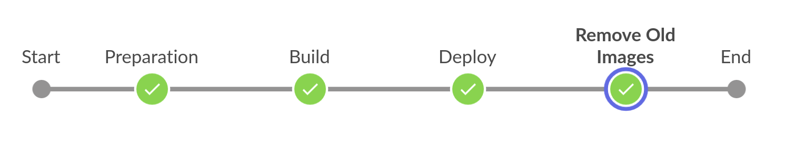

# Welcome to our ActiveSchool application serverside
## To visit our website follow the link below:
http://3.137.144.158/</br> 
</br>
 
</br>

## ⛏️ Built Using
  - [MongoDB](https://www.mongodb.com/) - Database
  - [Express](https://expressjs.com/) - Server Framework
  - [NodeJs](https://nodejs.org/en/) - Server Environment
  
   
## 🏁 Getting Started
To get the Node server running locally: </br> 
  Clone this repository
  ```sh
  git clone https://github.com/Maymaher/ActiveSchool.git
  ```
  Change the directory to	ActiveSchool  
  ```sh
  cd ActiveSchool 
  ```
  Install all required dependencies
  ```sh
  run npm install
  ```
  Start the local server
  ```sh
  run npm start
  ```
  Open http://localhost:3200 in your browser to see the server running. </br> 
Now the server is waiting the clientside to run. </br> 
Download Clientside from this link (https://github.com/Maymaher/ActiveSchool-ClientSide). </br> 
 
   
## Dockerize Express and Mongodb
<b>Backend Dockerfile and Docker compose file<b></br> 
  </br> 
   </br> 
  </br> 
  
  Build the images 
  ```sh
  docker-compose build 
  ```
  Run the containers 
  ```sh
  docker-compose up  
  ```
  
  ## Jenkins in CI/CD
  We used Jenkins to make continuous integration and continuous deployment pipeline 
   </br> 
  

